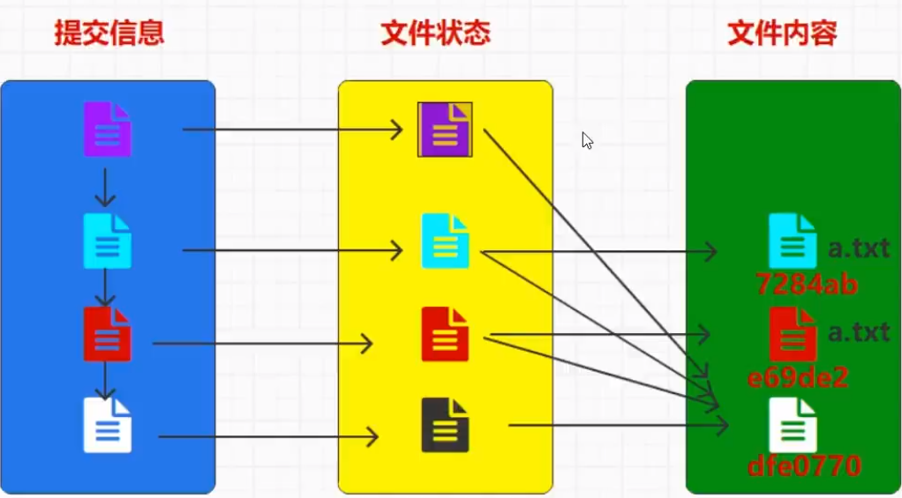

# Git

## Git工作机制

- 工作区---(git add)--->暂存区---(git commit)--->本地库---(git push)--->远程库

## 用户签名

- 设置用户签名：

  - ```bash
    git config --global user.name 用户名
    git config --global user.email 邮箱
    ```

- 这个邮箱不一定是要真实存在的邮箱，可以是虚拟邮箱，git并不会验证这个邮箱，<font color = red>首次下载需要使用命令查看是否配置了用户签名，不然会报错</font>，这个签名与将来登录GitHub的账号没有任何关系，只是识别出你是谁而已

- 查看签名

  - ```bash
    git config --global --list
    ```


## 签名的范围

- 签名有三个范围

  - system 整个系统范围内的，对计算机中所有的用户

  - global 对于当前计算机所使用的用户

  - local  对于当前仓库的目录

## 常用命令

- 初始化本地库

  - ```bash
    git init
    ```

  - 要想让git管理文件夹，首要要让git获得管理这个文件夹的权限，所以要初始化本地库，初始化后会出现.git的隐藏文件

- 查看本地库的状态

  - ```bash
    git status
    ```

  - 可以查看自己现在在哪一个分支，以及查看工作区中是否还有内容没有提交到暂存区

  - 在我们修改文件之后，使用命令，会出现提示已修改

  - git中是按照行来进行管理文件，修改了文件的一行代码，会提示1行删除，1行新增

- 添加到暂存区

  - ```bash
    git add 文件名
    ```

- 删除暂存区内容

  - ```bash
    git rm --cache 文件名
    ```

- 提交暂存区文件到本地库

  - ```bash
    git commit -m "日志信息" 文件名
    ```

  - 日志信息如果没写，git也会给你打开一个文件编辑器让你填日志信息

  - 提交后工作区就没有提示说需要提交的文件，会生成一个7位的版本号

- 查看版本信息

  - ```bash
    git reflog
    git log
    ```

  - git reflog是查看前7位的版本号，以及提交的信息，信息比较粗略

  - git log不仅仅可以查看到版本号，还可以查看到是谁提交的

- 误删除恢复命令

  - ```bash
    git restore 文件名
    ```

  - 这个方法用于恢复误删除工作区的文件，因为只是删除工作区的文件，存在本地库的文件仍然是存在的，所以能够通过命令进行恢复

- 回溯版本历史

  - ```bash
    git reset --hard 版本号
    git revert 要恢复版本的下一个版本号
    ```
    
  - 这里的版本号就是在commit是生成的7位版本号，先使用git reflog查看再进行回溯


## 版本控制

- 在Git中，它是不会删除任何文件，都是留存在本地库当中
- 在提交到本地库的时候，会为其分配一个版本号，这个版本号并不是直接指向文件，而是指向提交信息，提交信息里面的文件也有一个版本号，它登记的是文件的状态，文件的状态记录的是文件所在的位置
- 在修改文件以后，原来文件并不会被删除，而是在本地库中有两份，一份是未修改的，一份是修改以后的，通过文件状态指向，在查看时看不到删除文件是因为它没办法关联到删除后的文件
- 

## 分支操作

- 创建分支

  - ```bash
    git branch 分支名
    ```

  - 创建分支后，是将在创建分支时的文件夹的所有文件“复制”了一份到所创建的分支

  - 比如我在master分支上有HelloGit.txt，先创建了一个分支Lnapn，然后再master分支上又创建了HelloGit2.txt文件，再Lnapn分支上也只有一个HelloGit.txt文件

- 查看分支

  - ```bash
    git branch -v
    ```

- 切换分支

  - ```bash
    git checkout 分支名
    ```

- 合并分支

  - ```bash
    git merge 分支名
    ```

  - 合并分支后，如果master分支没有修改，则合并后直接将别的分支修改的地方直接覆盖

  - 若master分支进行了修改，分支也进行了修改，则会出现冲突，发生冲突后直接进行文件中手动进行修改

  - 在修改后，提交的时候不能带文件名

    - ```bash
      git commit "日志"
      ```

## 远程库操作

- 查看别名

  - ```bash
    git remote -v
    ```

- 创建别名

  - ```bash
    git remote add 别名 链接
    ```

  - 创建一个链接，会有两个别名，因为别名既可以拉取，也可以推送

- 删除别名

  - ```bash
    git remote remove 别名
    ```

- 重命名别名

  - ```bash
    git remote rename 别名
    ```

- 推送代码

  - ```bash
    git push 别名/链接 分支
    git push 别名/链接 master
    ```

  - 推送的代码最小单位为分支，依次推送，最小是分支

  - 如果本地库代码和远程库代码版本不一致，push操作是会被拒绝的，在开始push之前，一定要保证本地库的版本要比远程库的版本高

  - 在手动改本地代码之前，要先检查远程库和本地库的区别

  - 如果本地库已经落后，要先pull拉取一下远程库的代码，再将代码进行更改，直到代码更新到最新以后，再进行修改，提交，推送

- 拉取代码

  - ```bash
    git pull 别名/链接 分支
    git pull 别名/链接 master
    ```


- 克隆代码

  - ```bash
    git clone 别名/链接
    git clone 别名/链接 想要叫的文件名
    ```

  - 克隆代码不需要登录任何账号

  - 克隆做的三件事

    - 1、拉取代码
    - 2、初始化本地库
    - 3、创建别名
      - 默认别名是origin

## IDEA配置

- 配置git.ignore文件，在c:/user/用户名 下配新建文件，将所不想要提交至本地库的文件加入文件

  - ```.ignore
    # ignore these folders
    target/
    .idea/
    .settings/
    .vscode/
    bin/
    out/
     
    # ignore these files
    .classpath
    .project
    .settings
    .idea
     
    # filter databfile、sln file
    *.mdb
    *.ldb
    *.sln
     
    # class file
    *.com
    *.class
    *.dll
    *.exe
    *.o
    *.so
     
    # compression file
    *.7z
    *.dmg
    *.gz
    *.iso
    *.jar
    *.rar
    *.tar
    *.zip
    *.via
    *.tmp
    *.err
    *.log
    *.iml
     
    # OS generated files
    .DS_Store
    .DS_Store?
    ._*
    .Spotlight-V100
    .Trashes
    Icon?
    ehthumbs.db
    Thumbs.db
    .factorypath
    .mvn/
    mvnw.cmd
    mvnw
     
    # Files or folders need to be retained
    # ...
    ```

  - 再在c:/user/用户名 下面的.gitconfig添加以下内容

    - ```.gitconfig
      [core]
      	excludesfile = C:/Users/用户名/git.ignore
      ```

- 进入IDEA后配置Git，File->New Projects Setup->Settings for New Projects...

- Setting页面中选择Version Control->Git，在Path to Git executable中选择安装git路径，选择git.exe

## Gitlab

- 第一：设置外部url

  - external_url '192.168.xxx.xxx'

- 第二：设置设置时区

  - gitlab_rails['time-zone'] = 'Asia/Shanghai'

- 第三：设置数据存储地址

  - ```text
    git_data_dir({
    	"default" => {
    		"path" => "/usr/local/gitlab/data"
    	},
    	"alternative" => {
    		"path" => "/usr/local/gitlab/data/backup"
    	}
    })
    
    这两个路径default是数据主存储路径
    alternative是数据存储备份，为避免因磁盘毁坏而设置
    ```

- 第四：设置sidekiq最大并发量

  - sidekiq['max_concurrency'] = 20

- 第五：设置postgresql

  - postgresql['shared_buffers'] = "128M"
  - postgresql['max_worker_processes'] = "4"（最大工作进程）

- 第六：设置端口

  - nginx['listen_port'] = 8989

- 第七：关闭prometheus监控

  - prometheus_monitoring['enable'] = false

- 第八：重载gitlab

  - gitlab-ctl reconfigure
  - gitlab-ctl restart
  - gitlab-ctl status

- 第九：随着机器启动而启动

  - systemctl enable gitlab-runsvdir.service

- 第十：开放端口

  - firewall-cmd --zone=public --add-port=8989/tcp --permanent
  - firewall-cmd --reload
  - grant all PRIVILEGES on *.* to 92902@'192.168.31.243' identified by 'Lnapn547!';